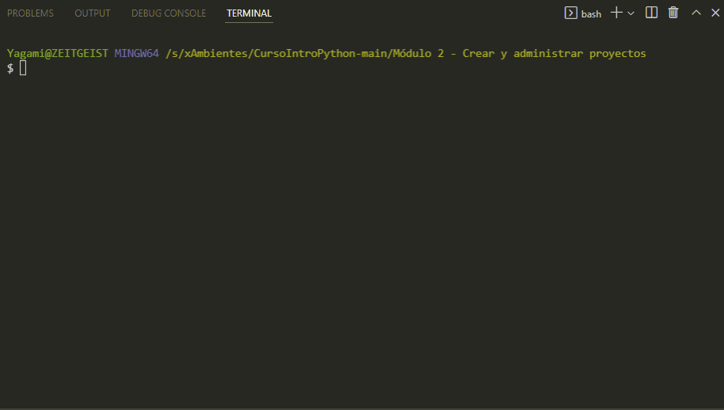
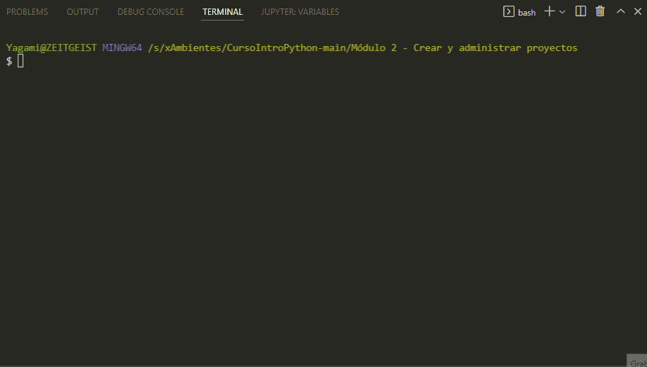

# Ejercicio - Crear un paquete

## Crear un entorno virtual

🔗 [Gif: Crear un entorno virtual](images/Screen_004.gif)

## Instalar una biblioteca

🔗 [Gif: Instalar una biblioteca](images/Screen_005.gif)

## Desactivar un entorno virtual

🔗 [Gif: Desactivar un entorno virtual](images/Screen_006.gif)

---

¡Felicidades! Has logrado crear y usar correctamente un entorno virtual.

Curso Propedútico de Python para Launch X - Innovacción Virtual.

Material desarrollado con base en los contenidos de MSLearn y la metáfora de LaunchX, traducción e implementación por: Fernanda Ochoa - Learning Producer de LaunchX.

Redes:
* GitHub: [FernandaOchoa](https://github.com/FernandaOchoa)
* Twitter: [@imonsh](https://twitter.com/imonsh)
* Instagram: [fherz8a](https://www.instagram.com/fherz8a/)
